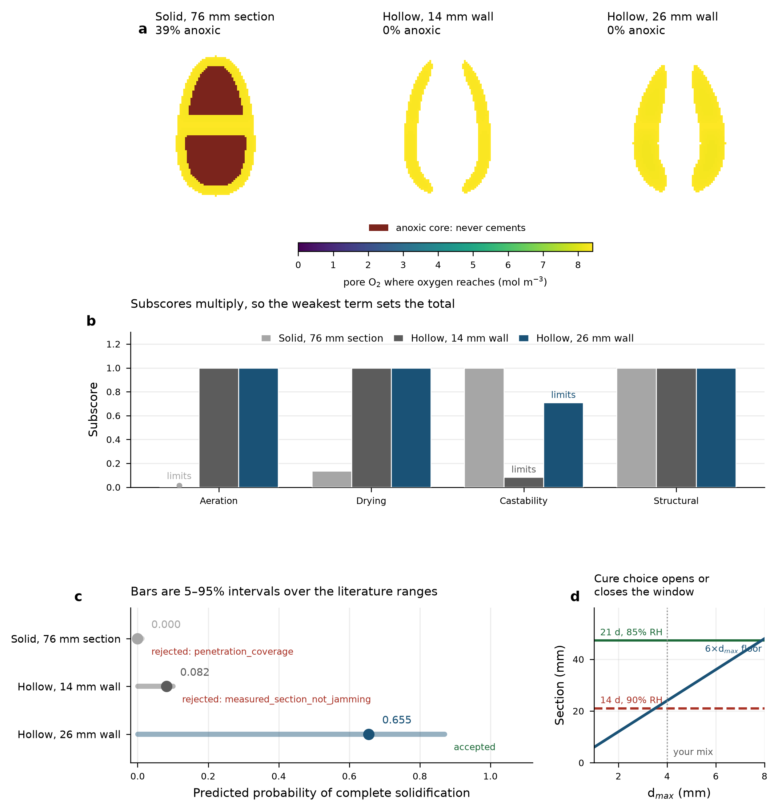
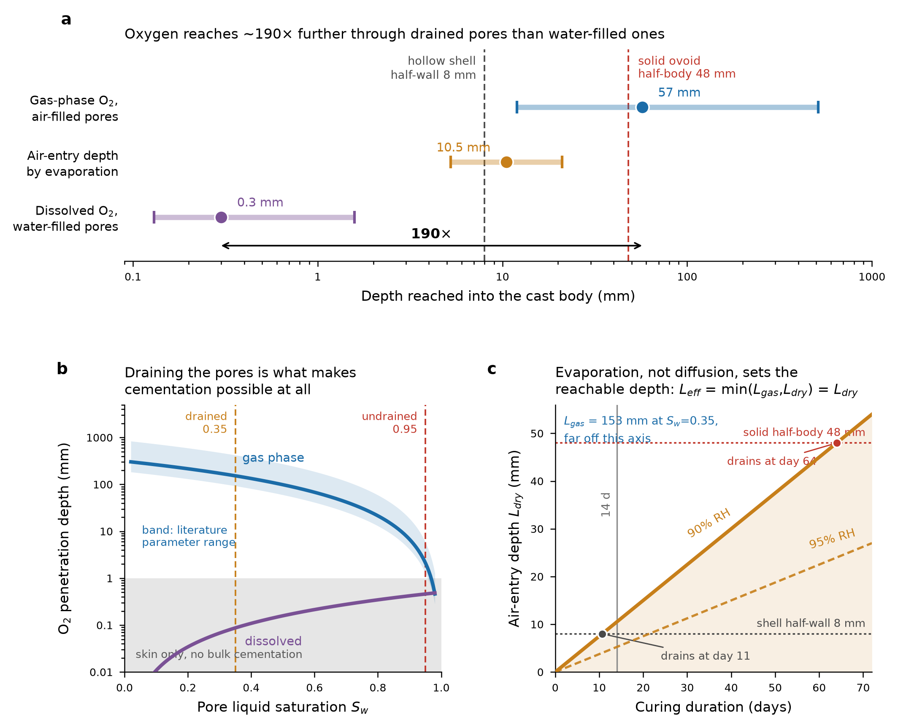
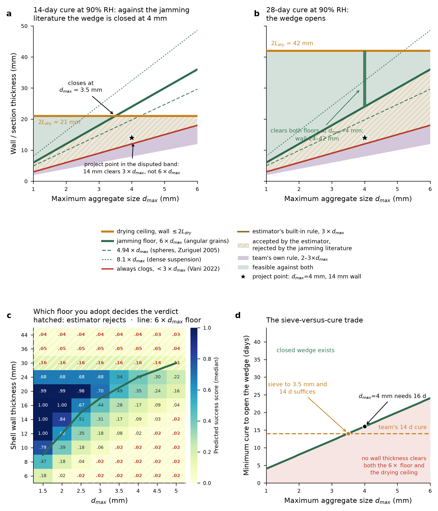

# biocast

**Parametric shape generation and success estimation for bio-cemented construction waste.**

Generates cast geometries for *Bacillus subtilis* MICP (microbially induced calcium
carbonate precipitation) on ground construction waste, checks them against a
machine-readable rule set, and estimates how likely each is to solidify completely —
with propagated uncertainty and an attributed failure mode.

Built for the *Still Life* project (A. Ioshpe, I. Kolodkin-Gal, Scojen Institute for
Synthetic Biology, Reichman University). The design brief asked for the team's casting
rules to be encoded "as hard parameters" so a model could "reject geometries liable to
create breakage points before the mould printing stage." This is that tool.



---

## The result it reproduces

The source pictorial reports one hard geometric lesson: early **solid** prototypes
failed — cracking and incomplete mineralisation — while a **hollow ovoid cast as two
halves** succeeded. The model recovers both outcomes from physics rather than being
told:

| case | cemented fraction | score | failure mode |
|---|---|---|---|
| solid ovoid, one-piece mould — *reported failure* | **0.45** | 0.000 | aeration |
| solid ovoid, split mould | 0.57 | 0.000 | aeration |
| hollow shell, split mould — *reported success* | **1.00** | 0.088 | castability |
| hollow shell, sharp rim (r = 0.5 mm) | 1.00 | 0.001 | structural |

Run `python validate_paper.py` to reproduce that table.

It also separates the two design moves, which the pictorial does not: **hollowing is
the decisive one** (0.45 → 1.00), while the split mould alone recovers only 0.45 → 0.57.
That is a testable prediction — *a solid form cast in halves should still fail.*

---

## Why it works: one mechanism

*B. subtilis* is an obligate aerobe, so the binding question is how deep oxygen reaches
into a cast body. It reaches **~57 mm through drained pores but only ~0.3 mm through
water-filled ones** — a factor of 190.

Bio-cementation is therefore only possible where evaporation has already drained the
pore network, and the governing depth is `L_eff = min(L_gas, L_dry)`. The drained depth
`L_dry` is bounded by the humidity discount on evaporation: at 90 % RH over 14 days it
is 10.5 mm, which is why a 96 mm solid lump keeps a permanently saturated, permanently
anoxic core while a 16 mm shell wall cements throughout.

**Humidity is the strongest process lever**: 90 % → 70 % RH triples the drained depth,
against 2.0× for doubling the cure and 1.7× for the fastest evaporation rate.



---

## Three findings that change practice

**1. The groove-width rule in the project notes is 2–3× too permissive.** The notes give
`w ≥ 2–3 × d_max`. Measured granular jamming puts the critical aperture-to-particle
ratio at 4.94 (spheres) to 6.0 (angular grains), with certain clogging below 3.0. At
`d_max = 4 mm` that is 24 mm, not 8–12 mm — and the ~10 mm Panot channel sits at the
always-clogs boundary. In the sweep, **576 designs pass the notes' rule but would cast
starved.**

**2. At 4 mm aggregate with a 14-day 90 % RH cure, no wall thickness works.** Castability
demands ≥ 24 mm; drying allows ≤ 21 mm. Two escapes, not equivalent:

- **cure at 85 % RH for 21 days** → feasible cells 62 → 379 (6.1×), best score 0.379 → 0.998
- **sieve below 3.5 mm** → keeps the 14-day schedule

Cheapest minimum intervention: at 4 mm the floor and ceiling meet exactly at a 16-day
cure, so **17 days** is the first schedule that opens the window.

**3. Tiles are capped at 0.236 and no parameter change lifts it.** A groove cut into a
brittle cast body is a notch: the root radius can never exceed the groove depth, so
`Kt ≥ 3` by construction and the structural subscore cannot exceed 0.237 at *m* ≈ 14.
The fix is a **dished** relief whose root radius exceeds its depth — a grammar
extension, not a slider.

Confirmed from the notes: the fillet-not-chamfer rule, the 32 mm face shell (matches
ASTM C90 exactly), and the 2–3 mm Panot relief. The 25 mm web is the superseded
pre-2011 C90 value — conservative, but don't cite C90 for it.



---

## Install and run

```bash
pip install numpy scipy trimesh manifold3d scikit-image shapely rtree pandas matplotlib
pip install streamlit                      # for the GUI only
PYTHONPATH=. python validate_paper.py      # reproduce the validation table
PYTHONPATH=. streamlit run biocast/gui/app.py    # interactive design studio
```

`biocast` is a local package, not on PyPI — run from the repository root with
`PYTHONPATH=.`. Requires Python 3.11+.

### Scoring one design

```python
from biocast.gui import engine as E

r = E.evaluate(
    "shell",
    dict(a=58.2, b=75.0, c=71.7, n=2.1, ovoid=0.40,
         wall=19.3, aperture_r=13.5, fillet_r=6.5),
    dict(d_max=2.0),                              # mix
    dict(cure_days=21, rh_pct=85, split_mould=True),   # process
)
print(r["score"], r["score_lo"], r["score_hi"])   # 0.998 with its 5–95 % interval
print(r["dominant_failure_mode"], r["failed_rules"])
```

`engine.evaluate()` is the single entry point: it meshes, diagnoses, measures the true
narrowest section, scores, and runs every constraint rule.

### Searching for the best shape

```python
from biocast.gui.app import GEOM_SPACE, GEOM_CHOICES, derive_geom

rows = E.search_shapes("shell", GEOM_SPACE["shell"], GEOM_CHOICES["shell"],
                       derive_geom, dict(d_max=4.0), dict(cure_days=21, rh_pct=85),
                       n_random=24, n_refine=2)
best = rows[0]        # ranked on score_lo, the 5th percentile, not the median
```

Random sampling to find a basin, then a compass search inside it. Ranking on the lower
bound rather than the median matters here: the intervals are wide and driven mostly by
an assumed biofilm volume fraction, so ranking on the median promotes whichever design
happens to have the widest interval.

### Generating a mould

```python
rec = E.mould_record("shell", {}, dict(d_max=4.0),
                     dict(cure_days=21, rh_pct=85), kind="silicone")
open("mould.zip", "wb").write(rec["zip"])         # jacket_a, jacket_b, core
print(rec["manufacturable"], rec["summary"]["checks"])
```

One call generates, checks and bundles, in a couple of seconds, and returns plain
data — no voxel grids — so the result is cheap to hold and the archive always exists
alongside the numbers that describe it. `kind="rigid"` gives a split negative to pour
the mix straight into.

---

## Deployment

The design studio ships as a container (`Dockerfile`, port 7860) and deploys to a
Hugging Face Space. Pushing to `main` deploys automatically via
[`.github/workflows/deploy-space.yml`](.github/workflows/deploy-space.yml), which smoke-tests
the engine and the mould bundler before uploading and then waits for the Space to
reach `RUNNING` rather than going green on a successful upload.

**There is no token to store.** The job authenticates with
[Trusted Publishers](https://huggingface.co/docs/hub/en/trusted-publishers): GitHub
mints an OIDC id token, `huggingface_hub` exchanges it for a Hub token scoped to that
one Space and valid for an hour. Configure once:

1. On the Hub, `https://huggingface.co/spaces/<owner>/<name>/settings` →
   **Trusted Publishers** → add a **GitHub Actions** publisher. Claims are matched
   exactly: `repository = yuvalkolodkingal/biocast`, `branch = main`,
   `workflow = deploy-space.yml`.
2. On GitHub, **Settings → Secrets and variables → Actions → Variables** → add
   `HF_SPACE_ID`, e.g. `megapandavip/biocast-studio`. It is a variable rather than a
   secret because a Space id is not a credential, and as a secret GitHub would mask
   it out of the build-log URL the workflow prints when a deploy fails.

To deploy by hand instead:

```bash
python deploy/push_space.py --repo <user>/<space> --dry-run
```

The upload is one atomic commit that adds, replaces the Space card and deletes files
no longer in the repository — `upload_folder` alone only ever adds, which leaves a
renamed module on the Space beside its replacement where Python will happily import it.

---

## Repository layout

```
biocast/
  params.py           parameter schema (ShellParams / BlockParams / TileParams, Mix, Process)
  constraints.py      machine-checkable rule set, each rule tagged TEAM / LIT / STD / GEOM
  score.py            composite estimator with Monte Carlo uncertainty
  mould.py            split-mould negative generation (hand-tuned typologies)
  mould_cast.py       mould generation by mesh CSG: a rigid split negative, or
                      two-pour silicone tooling with an oxygen-sized breather lattice
  grammars/
    sdf.py            signed-distance primitives and rounded CSG
    shell.py          hollow ovoid vessel — the proven typology
    block.py          hollow-core masonry unit (CMU)
    tile.py           relief paving tile (Panot)
  physics/
    fields.py         geometry diagnostics on the occupancy grid
    oxygen.py         obstacle-constrained reaction–diffusion solver
    drying.py         air-entry front and the drying coupling
    section.py        measured minimum section from the medial ridge
  gui/
    engine.py         one-call adapter — the only place the GUI touches physics
    app.py            Streamlit design studio
    viewer.py         3D shape preview with a sectioning plane (no extra dependency)
data/                 literature parameters (85 rows, 34 DOIs), sweep results
docs/                 methods report, GUI guide, Grasshopper spec, figures
examples/             mesh regeneration
stl/                  representative meshes (large ones are regenerated, see below)
```

---

## Documentation

| document | what it covers |
|---|---|
| [docs/methods_report.md](docs/methods_report.md) | equations, parameter provenance, validation, and nine documented limits |
| [docs/gui_guide.md](docs/gui_guide.md) | running the design studio and reading its output honestly |
| [docs/grasshopper_spec.md](docs/grasshopper_spec.md) | rebuilding in Rhino/Grasshopper, including what has no equivalent there |
| [docs/mould_notes.md](docs/mould_notes.md) | parting planes, draft, registration keys, vent sizing, print settings |
| [docs/mould_cast_notes.md](docs/mould_cast_notes.md) | the current mould generator: silhouette-offset tooling, the searched parting axis, and the four checks that remain |
| [docs/mould_auto_notes.md](docs/mould_auto_notes.md) | **superseded**, kept for its transport findings: why a silicone face does not breathe, and why an enclosed skin cements nothing |
| [docs/design_space_summary.md](docs/design_space_summary.md) | the 6912-cell sweep: what was feasible and why the rest failed |
| [docs/micp_kinetics_summary.md](docs/micp_kinetics_summary.md) | oxygen transport and kinetics literature |
| [docs/mechanics_summary.md](docs/mechanics_summary.md) | strength, jamming, and standards literature |
| [docs/source_brief.md](docs/source_brief.md) | consolidated extract of the pictorial and the project notes |

---

## Meshes

Small representative parts are committed under `stl/`. The large ones (a filleted block
at 2.5 mm voxel pitch is ~17 MB of ASCII STL) are **derived data** and regenerated in
about a minute:

```bash
PYTHONPATH=. python examples/regenerate_meshes.py --out stl
```

Every mesh is verified watertight on export; the mould volume balance closes with zero
unattributed volume.

---

## Reading the score honestly

**The score ranks designs; it is not a calibrated probability.** No pass/fail dataset was
available to fit it — the pictorial reports success qualitatively. Specifically:

- **Intervals are wide, sometimes uninformative.** One block design spans [0.182, 0.998].
  Designs whose intervals overlap should be treated as tied, not ranked.
- **The weakest input is biofilm volume fraction** (0.01–0.10, assumed, no retrieved
  source). It multiplies oxygen demand linearly and alone spans a decade.
- **Organism mismatch:** nearly all MICP strength literature is for *Sporosarcina
  pasteurii* (ureolytic, fast), not *B. subtilis*.
- **There is no usable UCS-versus-CaCO₃ relationship.** Pooled fits give R² ≤ 0.01 —
  placement of precipitate, not quantity, sets strength. A hard 3 % carbonate gate is
  used instead of a curve.
- **No mechanical test.** Every strength statement is a geometric stress-concentration
  argument plus a literature Weibull modulus.

One shipped inconsistency, left visible rather than silently patched:
`constraints.Thresholds.jam_ratio` defaults to **4.0**, while the granular-flow
literature supports **6.0**. The GUI defaults to 6.0 and exposes the slider; batch
callers should pass `Thresholds(jam_ratio=6.0)` explicitly. The choice changes which
designs are rejected, so it belongs to the user.

### What would most improve this

1. **A pass/fail table of your own casts** — geometry, `d_max`, cure schedule, outcome.
   Even 15–20 rows would turn the score into a calibrated model.
2. **One measurement of biofilm volume fraction**, collapsing the widest uncertainty.
3. **Sectioning one failed cast** and measuring cemented depth — tests `L_eff` directly.
4. **A UCS test on your own waste** with *B. subtilis*, replacing the proxy organism.

---

## Two pitfalls when extending the code

1. **Always build with `return_field=True` and pass `field=(d, origin, pitch)` into
   `geometric_diagnostics`.** trimesh's `.fill()` floods internal cavities (27 % volume
   overestimate), which makes every hollow design read as solid and saturates the
   aeration subscore at 1.0 for everything. `mesh.contains()` on an object-scale grid
   exhausts memory.
2. **New marching-cubes code needs `allow_degenerate=False`.** Flat faces land on grid
   planes, produce tens of thousands of exact zeros, and the mesh tears when vertices
   merge.

A third, specific to the rule set: `constraints._aeration_rules` reads
`cemented_fraction` from its `diag` argument, but that key comes from the **scorer**, not
from `geometric_diagnostics`. Passing the raw geometric diagnostics makes
`penetration_coverage` silently vanish from the verdict list — a design with a 39 %
anoxic core then reports as feasible. `gui/engine.py` merges the two and asserts both
rules ran.

---

## Provenance

Parameters live in `data/micp_kinetics_params.json` (43 rows) and
`data/mechanics_params.json` (42 rows), each carrying value, range, units,
`evidence_class`, organism, substrate, DOI, and derivation notes. Kinetics rows also
carry `retrieval_level`, with a validator asserting no row is `MEASURED` without
`FULL_TEXT`. **34 unique DOIs.** Of the 43 kinetics rows: 28 full-text, 9 abstract-only,
5 metadata-only, 1 with no retrievable source — all labelled.
