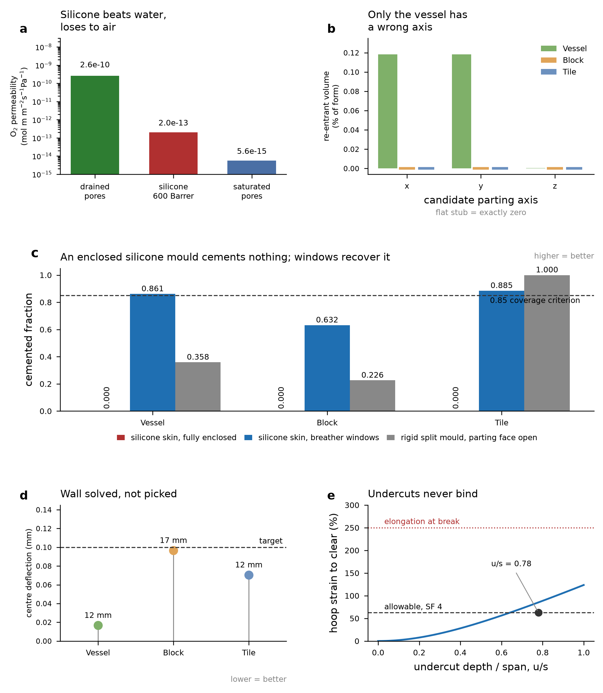

# Automatic mould generation — design record and verification

Two automatic paths share one measurement core: a **rigid** printed negative
(§1–§8) and a **silicone skin + rigid jacket** (§9–§14). §15 covers the sealed-face
boundary condition both paths need, §16 the GUI, §17 the files.

**Read §10 first if you are choosing between the two.** The reason to reach for
silicone is not breathability — it is the opposite of breathable — and picking it
for the wrong reason produces a mould that cements nothing.

*Panel (c) is the result to read first. Windows recover the vessel (0.861) and
tile (0.885) past the 0.85 criterion; the block reaches only 0.632 and is marked
as missing it, because its limit is drying rather than open area — see §11.*

---

## Part I — rigid (FDM) path

`biocast/mould.py` proved the geometry machinery on two **hand-tuned** typologies.
Every gate angle, drain radius, flange span, key ring and mould wall in
`build_shell_mould` / `build_block_mould` was a literal, which is why the tile
grammar had no mould at all: adding one meant writing a third driver by hand.

`mould_auto.build_auto_mould(geom, spec, mould_kind="rigid")` replaces those
literals with measurements. **The tile is the proof**: it was never tuned, and it
is the only one of the three that passes every check with no flag.

All lengths mm, angles deg. `spec = AutoSpec()` — d_max 4.0 mm, PETG E = 2.0 GPa,
nu = 0.4, deflection target 0.10 mm. Geometries: `ShellParams(wall=26.0)`,
`BlockParams(face_shell=37.0, web=30.0)`, `TileParams()`.

---

## 1. Verification table

| quantity | shell | block | tile |
|---|---|---|---|
| grammar pitch | 1.25 mm | 2.0 mm | 1.2 mm |
| parting axis (searched, not assumed) | 2 | 2 | 2 |
| parting coordinate | −17.25 mm | −1.00 mm | −0.40 mm |
| re-entrant volume at that plane | 0.0 % | 0.0 % | 0.0 % |
| draw depth | 88.75 mm | 96.0 mm | 20.4 mm |
| **draft requested** | 1.614° | 1.492° | 3.000° |
| **draft realised, lower / upper** | **1.608 / 1.611°** | **1.492 / 1.492°** | **3.000 / 3.000°** |
| relief per face | 2.50 mm | 2.50 mm | 1.07 mm |
| mould wall solved / used | 6.61 → 12.0 mm | 16.81 → 17.0 mm | 10.68 → 12.0 mm |
| deflection at that wall | 0.017 mm | 0.097 mm | 0.071 mm |
| realised wall, min / median | 11.25 / 17.54 mm | 15.23 / 20.00 mm | 10.80 / 12.00 mm |
| flange width / thickness | 58.75 / 26.75 mm | 58.75 / 26.75 mm | 58.75 / 26.75 mm |
| core strategy (measured) | **loose_core** (64.7 %) | **integral_boss** (95.9 %) | **integral_boss** (100 %) |
| gates / drains / bolts | 3 / 3 / 6 | 6 / 9 / 12 | 4 / 5 / 9 |
| **unattributed void** | **0.0 mm³** | **0.0 mm³** | **0.0 mm³** |
| closure residual | 0.0 mm³ | 0.0 mm³ | 0.0 mm³ |
| release, every part | clear | clear | clear |
| controls (must NOT clear) | 4/4 blocked | 2/2 blocked | 2/2 blocked |
| watertight + winding | all parts | all parts | all parts |
| Euler vs **counted** holes | −16 / −10 ✓ | −40 / −22 ✓ | −26 / −16 ✓ |
| apertures | **1 flag** | **1 flag** | **pass** |

The exact zeros in the balance row are expected and are *not* a suspiciously good
result: the partition is computed on occupancy, where a set partition is exact by
construction, so any non-zero value would be a coding error. The check that has
teeth is `unattributed`, which is what catches a mis-signed boolean.

## 2. Realised draft has to be measured on the FIELD, not the occupancy

The per-slice step is `tan(theta) * pitch` = **0.052 mm** at 1.49° and 2.0 mm
pitch, so the block's whole 2.5 mm of relief across a 96 mm draw is barely one
voxel. An area/perimeter recession over a 12 mm window returned **0.000°** on the
block's lower half and **0.072°** (median 0.993) on the upper — under-reporting the
1.49° request by one to two orders of magnitude, and exactly zero on one side,
which is indistinguishable from the sweep having silently degraded to the identity.

`cone_sweep` returns the field before thresholding and writes the step into it
exactly, and `slice_sdf2d` restores |grad_xy| = 1, so
`theta = arctan(|dG/dz| / |grad_xy G|)` on the |G| ≤ pitch band recovers the angle.
Validated against the hand-tuned baseline: **1.500° measured for its 1.5° request**.
The block's auto cavity also reproduces the baseline's slice-area profile to the
voxel (38 096 → 33 552 mm²), confirming the draft was always there.

## 3. Where the automation disagrees with the hand-tuned baseline

Reported, not reconciled. Each is a decision the automation makes on a stated
basis; where the baseline is better founded, say so.

| | auto | hand-tuned | why they differ |
|---|---|---|---|
| shell parting | −17.25 mm | −21.0 mm | same maximum-area plateau, tie broken toward mid-extent; 3.75 mm apart, both re-entrance 0 % |
| shell draft | 1.61° | 2.5° | auto targets 2.5 mm relief from the draw depth; the hand value was raised for a fragile green body — a judgement the spec cannot see. **Set `AutoSpec(draft_deg=2.5)` to recover it.** |
| block wall | 17 mm | 20 mm | auto loads each half to its OWN depth (96 mm, 17.8 kPa); the baseline used the full 190 mm height (35.2 kPa). For halves cast separately the auto basis is the physical one, but 17 mm has only 3 % margin — the baseline's 20 mm is the conservative choice and its 0.117 mm was a genuine miss of the 0.10 mm target. |
| flange | 58.75 mm | 25 / 28 mm | `auto_flange` demands key + bolt + three ligaments **side by side radially**; the hand moulds nest them at different radii (key_r_frac 0.30–0.35, bolt_r_frac 0.72–0.78) inside a narrower band. **The auto flange is ~2x heavier than it needs to be** and is the clearest remaining candidate for improvement. |
| key base Ø | 12 mm | 18 / 22 mm | auto sizes from the spec floor (3 × d_max); still 3x the FDM detail limit and chiral on the measured group, but it carries less clamping shear |
| core strategy | loose / integral / integral | loose / integral / — | **agrees**, and it is now derived from formed-volume fraction rather than known in advance |

## 4. Two flags — both are the CAST DESIGN, not the mould

The aperture inventory adds a check the hand-written record never ran: the
**narrowest as-cast section**, measured on the generated body rather than taken
from the nominal parameters. Against the 6 × d_max = 24.0 mm jamming floor:

| | measured as-cast p5 | measured on the design ALONE | draft cost | verdict |
|---|---|---|---|---|
| shell (nominal wall 26 mm) | 23.05 mm | **23.18 mm** | 0.14 mm | below 24.0 mm floor |
| block (nominal web 30 mm) | 20.00 mm | **20.00 mm** | 0.00 mm | below 24.0 mm floor |
| tile | 38.40 mm | 38.40 mm | 0.00 mm | pass |

**The mould is not the cause.** Measuring the grammars' own fields with no mould in
existence gives 23.18 and 20.00 mm — the shortfall is inherited from the validated
designs, and the draft adds 0.14 mm and 0.00 mm respectively. The nominal *parameter*
(26 mm wall, 30 mm web) clears the floor; the *narrowest local section* does not,
because the medial-ridge p5 sees where the wall thins near the aperture bore and
where the block's 8 mm edge fillet rolls off.

Which limit binds, and what to change:

- **shell and block: the granular jamming FLOOR binds.** Not the drying ceiling
  (42 mm at 28 d / 90 % RH), not release, not stiffness. The fix is on the process
  side or the design side, not the mould: **sieve to d_max = 3 mm** (floor drops to
  18 mm and both clear with margin), or thicken the wall/web. Redrawing the mould
  cannot help — it is already within 0.14 mm of the design it was asked to cast.
- **tile: nothing checked here binds.** Section 38.4 mm sits between the 24 mm floor
  and the 42 mm drying ceiling, and it is the only typology needing no intervention.

## 5. Block sections against ASTM C90

Run lengths across the unit at y = 0, nominal and as-cast measured on the same grid:

| location | nominal fs / web | as-cast fs / web | draft cost |
|---|---|---|---|
| parting plane | 34 / 24 mm | 34 / 24 mm | 0 / 0 mm |
| prismatic band (z = +40) | 34 / 20 mm | 30 / 20 mm | 4 / 0 mm |
| end zone (z = +90) | 28 / 16 mm | 28 / 16 mm | 0 / 0 mm |
| **C90 current floor** | — | **31.75 / 19.1 mm** | — |

Identical to the hand-tuned mould's sections at every station. The nominal values
track the grammar's own 2° `core_taper` (analytic prediction at z = 0: fs 33.7,
web 23.4 mm against 34/24 measured), which is why they are *not* the flat 37/30 the
parameters name. As-cast face shell falls to **30 mm at z = +40, below the 31.75 mm
C90 floor**, and the end zone reads 28/16 with **zero draft cost** — that is the
block's own 8 mm edge fillet, the same limitation the hand-tuned record flagged.
**19.1 mm is the current C90 web minimum; 25 mm is the superseded pre-2011 value.**

## 6. Silent failures found and fixed while building this

Each was caught only because a check disagreed with a count, never by inspection.

1. **Ray-casting a mould-grid mask with the object grid's origin.** Rays started
   from a point offset by `lo − o_z`, so keys landed partly in air where
   `assemble`'s intersection deletes them — **1462.9 of 1938.4 mm³ nominal** — and
   every volume check still closed, because a feature that was never there cannot
   unbalance anything.
2. **Drains placed at a fixed fraction of the outline radius.** On the block, 8 of
   9 landed in the **core voids** — mould material, not cast body — so each ran from
   the outer floor up through an integral boss and opened above the parting plane,
   draining atmosphere instead of the cast body. On the vessel the same rule left
   3.8 mm of edge clearance for a 6.0 mm bore. The balance cannot tell a hole that
   drains from a hole that does not; only measuring clearance on the object's own
   footprint can.
3. **Unconstrained clearance maximisation collapses.** The maximum of a
   distance-to-edge field on a convex footprint is the incentre, and it is the
   maximum in *every* angular sector at once: the tile's five drains merged into
   **one hole**. Visible only because the topology count (1) disagreed with the
   number placed (5). A minimum separation is required, not garnish.
4. **A one-voxel dilation double-counts through-holes.** `L0` and `U0` are disjoint
   but share a face, so dilating a lower-half drain reaches upper-half material.
   That inflated the block's expected upper genus from 12 to 17 and produced a
   spurious Euler mismatch (−22 measured against −32 "expected") **on geometry that
   was correct** — the check would have condemned a good mould. Replaced by a
   per-slice enclosure test, validated against the hand-tuned record (shell 10/4,
   block 14/6 genus, both reproduced exactly).
5. **Feeding the key size back into the flange size diverges.** `auto_key_size`'s
   `0.42 × flange` term is a *ceiling*, not a driver; iterating it against
   `auto_flange` converges to flange 72.8 / key 26.0 mm — a third wider than the
   fasteners need. Sized in one pass, ceiling checked afterwards.
6. **The cavity source depends on the core strategy.** Eroding the *object* of a
   hollow vessel moves its outer surface in and its inner surface out at once, so
   the wall thins by **twice** the relief — 8.6 mm on a 26 mm wall at the vessel's
   draw, landing below the 24 mm jamming floor and breaking the very design the
   baseline validated. With loose cores the halves are cut from the slice-filled
   **form** instead, so both surfaces move together.

## 7. Non-z parting axes

`analyse_parting` is free to return axis 0 or 1, while `mould.assemble`,
`cup_flange_block` and `cone_sweep`'s default all assume the parting normal is z.
Rather than teach four functions an axis argument (and risk one keeping the old
default silently), the grids are permuted into a z-normal frame by the **cyclic**
permutation `(axis+1, axis+2, axis)`, whose determinant is **+1** for all three
axes — verified — so handedness is preserved and no exported STL is mirrored.

All three baseline typologies happen to choose axis 2, so the path was exercised
deliberately on `ShellParams(a=30, b=55, c=78, wall=26, aperture_r=0)`, whose
shortest draw is along x: **axis 0 chosen** (draw 26.2 mm against 48.8 and
96.2 mm), balance exact, both halves release, realised draft 3.000° for a 3° request,
and `obj_mesh` registers with the occupancy grids to 0.1 mm on all six bounds.

## 8. Rigid path files

- `stl/moulds_auto/auto_rigid_shell_{lower,upper,core_lo,core_up}.stl`
- `stl/moulds_auto/auto_rigid_block_{lower,upper}.stl`
- `stl/moulds_auto/auto_rigid_tile_{lower,upper}.stl` — **no hand tuning existed for this typology**
- `data/mould_auto_rigid_verification.csv` — the table in §1, full precision
- `data/mould_auto_vs_handtuned.csv` — the comparison in §3

Print settings, liner and clamping guidance are unchanged from
`docs/mould_notes.md` §7 and apply to these parts as well.

---

# Part II — silicone skin + rigid jacket

`mould_silicone.build_silicone_mould(geom, SiliconeSpec(), AutoSpec())` generates
a conformal elastomer skin, a two-part rigid jacket, a breather-window pattern
sized on aeration, and the printed pour shell that makes the skin. It reuses the
whole measurement core from Part I — parting, wall solve, flange, keys, cores —
and changes four things, each for a mechanical reason.

## 9. Why an elastomeric skin at all

**Not for breathability. For zero cavity draft and undercut tolerance.**

A rigid mould must taper every drawn face or the cast will not release, and the
relief is charged against the section: at the block's 96 mm draw, 1.492° removes
2.50 mm per face, which is why nominal web had to rise from 25 to 30 mm to keep a
25 mm as-cast floor. A skin releases by stretching instead, so the cavity is
generated with **zero draft** and that budget returns to the designer — **5.0 mm
of web on the vessel and block, 2.1 mm on the tile**.

The strain a skin needs to clear an undercut of depth `u` across span `s` is
geometric:

    eps = sqrt(1 + (2u/s)^2) − 1

At Shore 30A with 250 % elongation at break and a safety factor of 4, the
allowable is 62.5 %, which admits `u/s` up to **0.78** — a deep undercut.
Measured worst case on all three typologies: **0.0 %**. Undercuts are nowhere
near binding; this is spare capacity, not a constraint being met.

What *does* bind on the vessel is the **one-piece hoop strain of 163.5 %**, which
exceeds the 62.5 % allowable and is why its outer skin is parted rather than
demoulded as a single glove. The distinction matters: the skin is split because
of the *global* hoop stretch over the widest section, not because of any local
re-entrant feature.

## 10. The finding that decides whether silicone is usable: the skin is a SEALED face

PDMS is famously oxygen-permeable — 350–800 Barrer, 600 Barrer measured on RTV 615
(Blume et al. 1991) — so a silicone mould "should" breathe. **It does not**, and
the reason is that the comparison which decides bio-cementation is against
*drained pores*, not against water. Series diffusive resistance, `R = L/P`:

| medium | permeability, mol·m/(m²·s·Pa) | note |
|---|---|---|
| drained pore network | 2.563 × 10⁻¹⁰ | `D_eff/(RT)`, Millington–Quirk at φ = 0.40 |
| silicone, 600 Barrer | 2.009 × 10⁻¹³ | 600 × 3.3464 × 10⁻¹⁶ |
| saturated pore network | 5.567 × 10⁻¹⁵ | `D_eff × S`, Henry basis |

A 6 mm skin against the vessel's 26 mm wall therefore carries **294× the
resistance of the drained wall behind it** (bounds 220–505× across the 350–800
Barrer envelope) and only **0.0064×** that of a saturated one. Both rows are
needed to state the finding honestly: PDMS genuinely beats water by a wide margin
— which is what makes "silicone breathes" *feel* right — and loses to air by two
and a half orders of magnitude.

The vapour side compounds it rather than offsetting it. At cure conditions
(saturated pore air inside, 90 % RH chamber outside, 30 °C) a 6 mm skin passes
**0.848 g/(m²·day)**, against roughly 1500 g/(m²·day) of free evaporation. The
drying relation `L_dry = E(1−RH)t/(φ·ΔS)` then collapses from **21.0 mm** open-faced
to **0.119 mm** behind the skin. Since oxygen only travels far through pores that
evaporation has already drained, throttling drying throttles aeration too — the
two limits move together, in the same direction, for the same reason.

**Conclusion: treat a mould face — silicone or rigid — as no-flux.** Only
genuinely open area is atmosphere.

### Two numbers in this section were corrected

The generator originally defaulted to a hand-picked 520 Barrer mid-range value and
reported the resistance ratio as 210x, where `data/elastomer_params.json` derives
294x from the measured 600 Barrer. It also computed the drained depth behind the
skin by scaling the open-face `L_dry` by the flux ratio, which applies the (1 - RH)
factor twice — the silicone-limited flux already *is* the RH-driven rate — reading
0.012 mm against the correct 0.119 mm. Both are fixed: `barrier_diagnostics` now
takes its permeabilities from the measured pair (600 Barrer O2, 23 000 Barrer water,
Blume et al. 1991, RTV 615) and substitutes the flux into the drying relation
directly. All seven barrier quantities now agree with the provenance-tagged
parameter file to within 0.26 %.

A third error was fixed in the same pass: saturated-pore permeability was being
computed with the gas relation `D_eff/(RT)` instead of Henry's law `D_eff * S`.
Those differ by a factor of 36, and the gas form overstates wet-pore permeability —
which weakens the very asymmetry that explains why the permeability intuition
misleads. None of the three affects the geometry: the barrier block is diagnostic,
and window sizing runs off the oxygen field solve.

### The WVTR figure

An earlier working value in this project put the skin WVTR at 16.7 g/(m²·day),
scaled inverse-thickness from "2000 g/(m²·day) at 50 µm". No datasheet, paper or
standard was ever retrieved behind that 2000 figure and no test temperature or RH
gradient travels with it, so it is recorded in `data/elastomer_params.json` as
`WVTR_tds`, **ASSUMED**, retained only as an order-of-magnitude cross-check. The
0.848 g/(m²·day) above is derived from the measured water permeability (23 000
Barrer, same source as the O₂ figure) at the *actual* cure driving force. A
supplier WVTR is quoted at full gradient and 38 °C, which alone accounts for a
factor of 15.6 — the reason a datasheet number cannot be dropped into a cure
calculation unchanged.

The direction of the conclusion is unaffected: 16.7 and 0.848 g/(m²·day) are both
far below free evaporation, so the skin is a sealed face either way. Window
sizing was driven by the field solve, not by this number.

## 11. Breather windows, sized on aeration rather than by eye

Because the skin seals, a fully enclosing one reproduces the source paper's
solid-cast failure exactly. So both skin and jacket are perforated with an
**aligned** window lattice — a window in the skin with jacket behind it is not a
window — and the pitch is reduced until the oxygen field solve meets coverage.

| | vessel | block | tile |
|---|---|---|---|
| window Ø / pitch | 10 / 20 mm | 10 / 17 mm | 10 / 28 mm |
| open area fraction | 19.8 % | 20.1 % | 8.0 % |
| **cemented fraction, enclosed skin** | **0.000** | **0.000** | **0.000** |
| **cemented fraction, windowed** | **0.861** | **0.632** | **0.885** |
| cemented fraction, rigid split mould, parting face open | 0.358 | 0.226 | 1.000 |
| meets 0.85 | yes | **no** | yes |

Three things in that table are worth stating plainly.

**Enclosed is 0.000, not merely poor.** Nothing drains within the cure, so the
body is anoxic by construction — the value is a consequence of the boundary
condition, not a marginal shortfall.

**The windowed skin beats the open-faced rigid mould on the vessel and block.**
That is not a contradiction of §10: a distributed lattice puts open area where the
body is thick, whereas the rigid mould's single open parting face only aerates
material near that plane. Silicone is a *worse* material and a *better* boundary
geometry, and the geometry wins here.

**The block fails, and the binding limit is DRYING, not window fraction.** Its
85th-percentile geodesic path to open air is 30 mm against `L_dry` = 21.0 mm.
Adding open area does not fix that — the honest move is to change the process:
curing at **85 % RH reaches 0.85, and 80 % RH gives 0.963**. Sieving to a smaller
`d_max` would also work by permitting thinner sections. Redrawing the window
pattern would not.

Read all three windowed values as *at* the criterion rather than comfortably past
it: the oxygen demand term alone spans a factor of ~26 across the literature, and
the coverage criterion is itself a convention.

## 12. The jacket takes the draft, and the release ORDER is verified

The skin absorbs the object's detail, so the jacket is generated against the
skin's smooth outer offset and the draft is applied **there** — migrated off the
cast body onto a surface where relief costs nothing. The jacket is mandatory, not
optional: silicone at ~1.1 MPa cannot hold a section against mix pressure, and
`auto_wall` sizes the jacket for the full load with a knock-down for the
perforation, since a windowed plate is less stiff than a solid one.

Disassembly is **jacket off skin first, then skin peeled off the cast**, and the
generator verifies that order rather than assuming it: the jacket clears the
skin+cast assembly, and the skin then clears the cast. A **discrimination
control** confirms the test is not vacuous — an undrafted jacket *does* interfere
(`control_interferes = True` on all three). A release test that passes everything,
including things that should fail, is measuring nothing.

## 13. Silicone volume is the cost driver

| | vessel | block | tile |
|---|---|---|---|
| skin thickness, requested → realised (median) | 6.0 → 6.19 mm | 6.0 → 5.21 mm | 6.0 → 5.9 mm |
| silicone volume | 316 cm³ | 1858 cm³ | 719 cm³ |
| **silicone mass at 1.15 g/cm³** | **363 g** | **2137 g** | **719 g** |

The block needs over 2 kg of rubber per mould, which at mould-silicone prices is
the dominant consumable and is a real argument for the rigid path on that
typology — reinforced by the block being the one that misses coverage anyway.

Realised thickness is measured off the generated geometry, not assumed: the
block's 5.21 mm median against a 6.0 mm request reflects the offset being
measured across a rounded corner field, and is reported rather than smoothed.

## 14. Silicone path verification

Every part: volume balance exact (**unattributed 0.0 mm³**), release sweeps clear
in the correct order with controls interfering, watertight and winding-consistent
after vertex merge, Euler number matched against counted through-holes, aperture
classes checked per class. 21 parts across three typologies.

**One caveat on the topology check.** A perforated skin has a genuinely high
genus — the block's is −2054 — so "Euler matches counted holes" is a much weaker
statement here than on a rigid half with 12 bolt holes: a single missing window
among hundreds would shift the count by 2 and could hide inside the tolerance on
the lattice count. The check that has teeth on these parts is the volume balance.

**STL watertightness must be checked after merging vertices.** STL stores every
triangle's vertices independently, so a freshly written file reads
`is_watertight = False` on load until duplicates are merged — all 29 parts read
non-watertight raw and watertight after merge, with volumes identical to four
decimal places. Reporting the raw result would have condemned every part in the
set on a file-format artefact.

---

# Part III — integration

## 15. The sealed-face boundary condition

`physics.fields.exposure_mask` treats every air voxel connected to the grid
boundary as atmosphere, which is right for a demoulded body and wrong for one
still in its mould, where the path to air runs through solid mould. Using it on a
moulded body silently grants a fully enclosed cavity the same access as an
open-faced cast — and because the aeration subscore saturates when everything
looks exposed, *every* mould then scores like the successful open-faced case,
including the enclosed geometry that fails.

`exposure_mask_in_mould(occ, mould_occ, ...)` treats mould material as no-flux and
returns the open-area bookkeeping alongside the mask. On the rigid tile mould, at
28 d / 90 % RH:

| boundary condition | cemented fraction |
|---|---|
| demoulded body (reference) | 1.000 |
| closed rigid mould, all faces sealed | 0.515 |
| split mould, parting face open | 1.000 |

Curing the halves **open-faced** is what makes the difference. Assembling them
early converts the parting face from an oxygen source into a sealed interface —
the same mechanism as the enclosed silicone skin, on a rigid mould.

These are drained-depth values (`depth <= L_dry`), not the field solve; the
silicone path runs the full solve because window sizing depends on it. The two are
not interchangeable and the return states which it is.

## 16. Design studio

A **Mould** tab generates either mould type for whatever the Design tab currently
shows. It leads with the aeration comparison rather than the part list, because
that is the decision the geometry has to survive; the silicone panel states the
sealed-face finding inline so nobody selects silicone expecting it to breathe.
Geometry parameters are keyed by typology in session state, so switching typology
cannot hand the generator another shape's parameters — it falls back to grammar
defaults and says so.

The mould runs at the **grammar's** pitch, not the coarsened interactive scoring
pitch (block 3.0 mm, tile 1.6 mm): a 0.30 mm key clearance and a 10 mm window
lattice cannot be represented on a 3 mm voxel, and a mould verified against its own
discretisation is not verified.

## 17. Files

Silicone parts, per typology `{shell,block,tile}`:

- `stl/moulds_auto/auto_sil_<typ>_{skin,skin_lower,skin_upper}.stl` — the elastomer
- `stl/moulds_auto/auto_sil_<typ>_skin_core_lining*.stl` — cavity linings, which
  demould differently from the outer skin (squeezed out through the aperture)
- `stl/moulds_auto/auto_sil_<typ>_{jacket_lower,jacket_upper}.stl` — print these
- `stl/moulds_auto/auto_sil_<typ>_{pour_shell_lower,pour_shell_upper}.stl` — the
  former the skin is cast in; a skin that cannot be manufactured is not a design
- `data/mould_auto_silicone_verification.csv` — full precision, 75 columns
- `data/elastomer_params.json` — 35 provenance-tagged rows, 15 MEASURED /
  14 DERIVED / 6 ASSUMED, 9 condition-mismatch flags
- `docs/elastomer_summary.md` — what was retrieved, what was assumed, weakest rows
- `docs/figures/mould_auto_overview.png` — the figure at the top of this record

STLs are **not committed** (~291 MB). Regenerate with:

    PYTHONPATH=. python examples/regenerate_moulds.py --out stl/moulds_auto

which re-runs every check and prints failures rather than suppressing them.

## 18. What this record does not cover

No part of this is a structural sign-off. Nothing here has been cast: the
verification is geometric and transport-based, run against models whose parameters
carry the mismatch flags recorded in `elastomer_params.json`. The coverage
criterion is a convention, the success scores rank designs rather than predicting
outcomes, and no fitted pass/fail dataset exists for this system. The silicone
mechanicals are supplier and handbook values for named grades, not measurements on
the rubber this team would buy, and none of them were measured after 28 days in
contact with an alkaline urea/CaCl₂ solution — which `docs/elastomer_summary.md`
names as the single measurement that would most improve the set.
